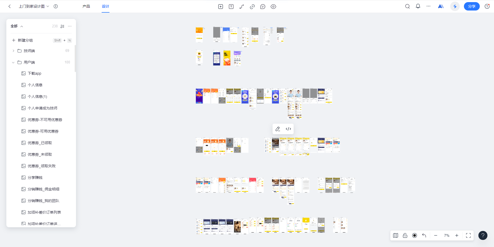
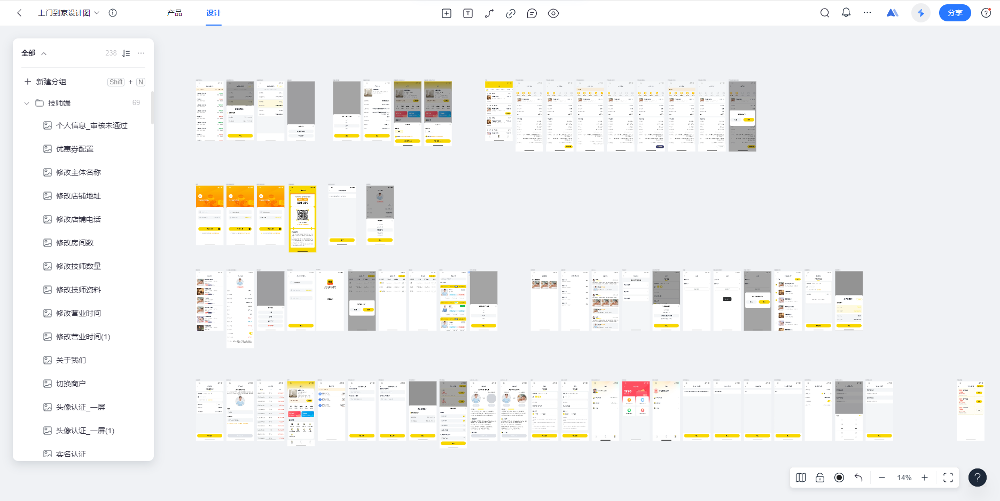
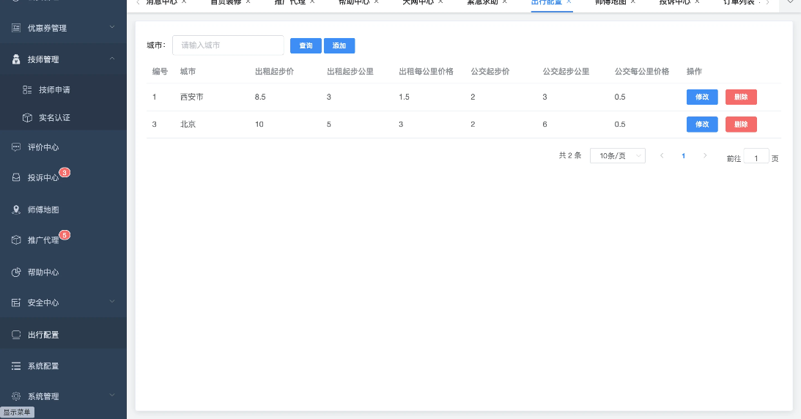
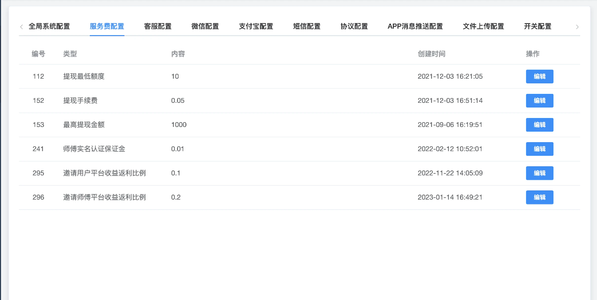
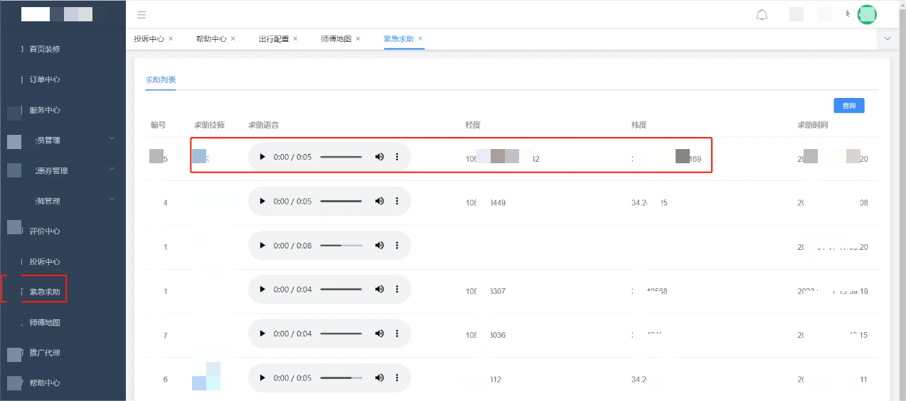

# 乐宅到家-JAVA语言-类网约-东郊到家-预约上门服务平台

#### 介绍

乐宅到家是一个类东郊、网约到家上门服务平台，旨在为用户提供便捷的上门按摩以及其他个性化上门服务。通过我们的平台，用户可以轻松预约专业的服务人员，享受在家或办公室的舒适服务体验。

## 产品介绍

1. 乐宅到家是一款基于JAVA语言开发的高质量上门服务预约平台。我们的目标是为用户提供便捷、高效的服务体验。通过我们先进的技术架构和用户友好的界面设计，无论是预约按摩、家政服务还是其他个人护理项目，用户都能轻松找到满意的服务提供者。
2. 平台拥有用户端、技师端（均为移动端）；后台管理端、城市管理端、大数据平台等（pc端）。
3. 目前平台集成了微信支付、短信验证码、短信通知、地图定位、数据统计、数据可视化等功能模块。

## 演示地址
微信扫一扫

## 软件架构
1. 前端采用uni-app开发，适配多端小程序、公众号H5、APP。确保良好的交互性和响应速度。
2. 后端采用Spring Boot框架为核心，利用其强大的模块化管理和依赖注入特性简化开发流程，编码规范完全按照阿里巴巴编码规范。使用Nginx作为反向代理服务器，对请求进行智能调度，提高系统的稳定性和响应能力。

## 部分功能概述

#### 用户端

- **服务分类展示：** 显示各类服务的图标和简介，方便用户快速找到感兴趣的服务类别。

- **推荐服务：** 根据用户的历史行为和偏好推荐相关服务。

- **服务筛选：** 允许用户按照服务类型、价格范围、距离等因素筛选服务。

- **服务详情：** 展示具体服务的详细信息，包括服务描述、价格、服务时长等。

- **服务评价：** 展示过往用户的评价和评分，帮助用户做出决策。
- **位置定位：** 自动识别用户当前位置，提供附近的服务提供者列表。
- **时间选择：** 提供灵活的时间选择机制，允许用户根据自己的时间安排进行预约。
- **一键预约：** 用户可以快速选择所需的服务类型，并在几秒钟内完成预约过程。

- **支付与确认：** 微信支付（APP支付、H5支付、小程序支付）、支付宝支付（APP支付、H5支付）、余额支付功能；

- **数据加密：** 对用户的敏感信息进行加密处理，确保数据安全。

- **营销体系：** 优惠券（平台优惠券），会员充值赠送金额。
- **安全系统：** 自动拨打平台客服电话、拨打报警电话。
- **分销体系：** 一级分销，邀请好友注册得佣金、得专属优惠券、分销赚钱、我的团队、分销佣金明细；

- **服务评价：** 在服务完成后，用户可以对服务进行评价和打分。

#### 技师端

- **个人信息管理：** 技师可以编辑个人资料、更改密码、上传服务照片等。
- **工作时间表：** 设定自己的工作时间和空闲时段。
- **新订单提示：** 当有新的预约请求时，技师会收到即时通知。
- **订单详情：** 查看订单的具体信息，包括服务类型、时间、地点、客户信息等。
- **系统消息：** 接收来自平台的消息，如新订单通知、订单状态变更等。
- **客户沟通：** 与客户进行即时聊天，解决疑问或调整预约细节。
- **接收评价：** 查看客户的评价和反馈，了解服务质量。
- **紧急求助按钮：** 在遇到紧急情况时，技师可以触发紧急求助按钮，系统将会进行录音，必要时进行报警处理。
- **即时通讯：** 技师可以通过内置的即时通讯工具与用户进行交流。
- **语音通话：** 支持语音通话接入阿里云隐私号码功能，方便技师与用户之间进行更直接的沟通。
- **技师位置：** 平台会实时记录技师上线后得位置。
- **位置共享：** 技师可以共享自己的实时位置，便于用户了解技师的位置信息。

#### 平台管理端

| 功能       | 说明                                                         |
| ---------- | ------------------------------------------------------------ |
| 首页       | 报表大屏、快捷方式                                           |
| 技师管理   | 技师管理、技师审核、技师等级自动评估、技师资质审核           |
| 优惠券管理 | 平台优惠券配置、新人优惠券配置                               |
| 服务项目   | 服务项目分类、服务项目管理                                   |
| 会员管理   | 用户管理、会员等级价格设置                                   |
| 城市加盟   | 城市加盟商审核、城市加盟商管理                               |
| 技师地图   | 查看技师实时地图位置信息                                     |
| 平台配置   | 用户协议、隐私协议、常见问题、客服电话、城市管理、订单退款设置、通用协议管理、首页轮播图、平台佣金设置、城市代理端佣金设置、平台黑名单设置 |

## 功能截图

### 用户端设计图

### 技师端设计图

### 管理端部分截图

## 产品体验
如果您对本项目有兴趣，合作请使用微信扫描二维码添加客服。本项目位商业授权源码，购买后源码100%开放。

